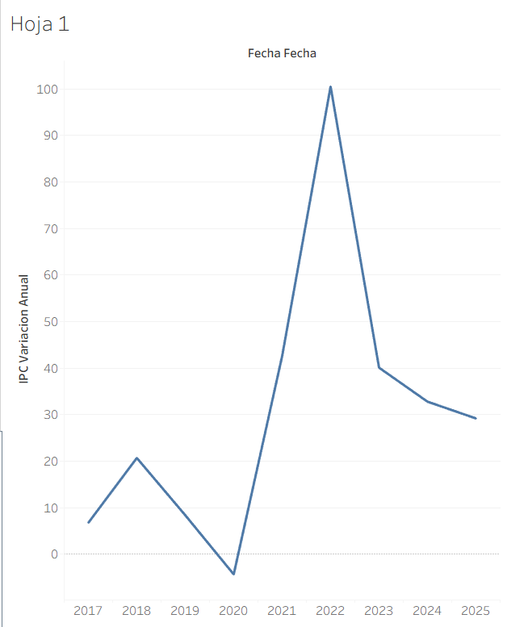
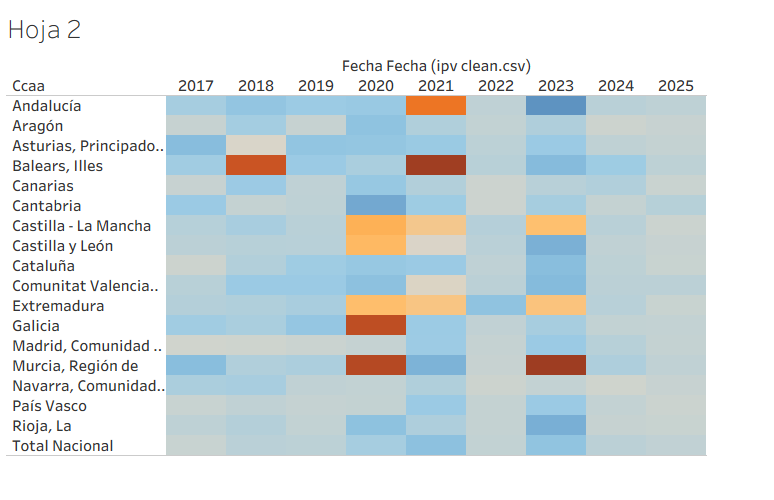
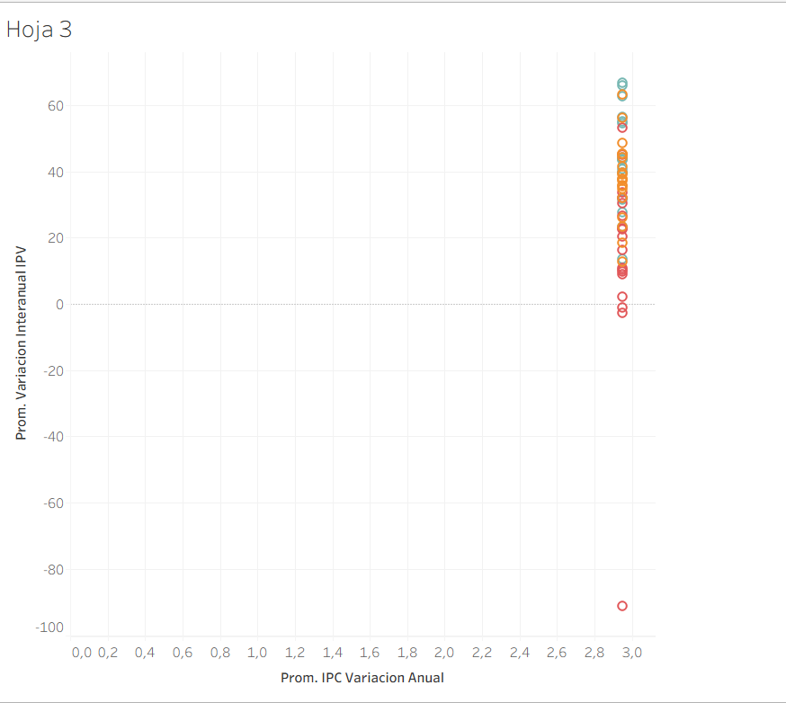
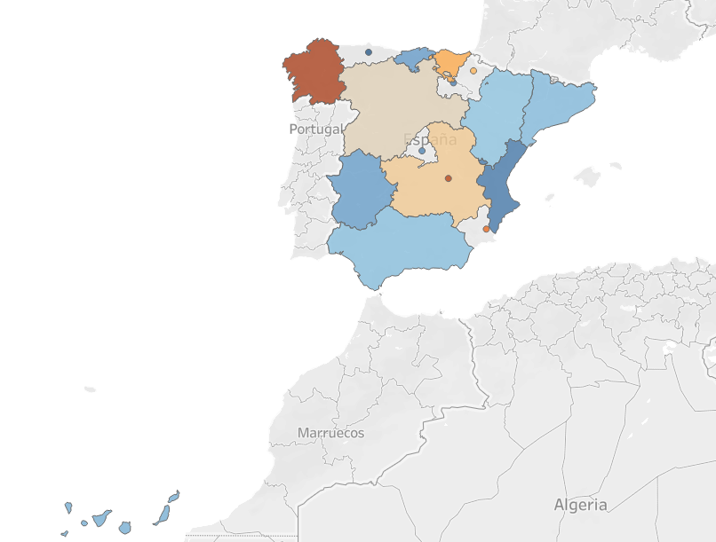

### Extracción y filtrado de datos del INE en DataFrame
Este script de Python permite obtener datos desde la API del Instituto Nacional de Estadística (INE) de España y filtrarlos fácilmente según las columnas indicadas, facilitando el análisis posterior en pandas.

### Descripción
El archivo contiene la función obtener_datos, diseñada para acceder a distintos endpoints de la API del INE y devolver los datos en un DataFrame de pandas, ya filtrados por las columnas que el usuario especifique. La función soporta tanto endpoints del tipo DATOS_TABLA (listas de series) como DATOS_SERIE (serie individual con sus datos).

### Requisitos
**Antes de ejecutar el script, asegúrate de tener instaladas las siguientes dependencias:**

 - **Python 3.x** --> Cualquier versión de python de 3.x en adelante recomendada 3.13.8

 - **Un gestor de base de datos** --> Sirve cualquiera que admita MySQL por ejemplo MySQL Workbench, HeidiSQL, etc 

###### LIBRERIAS EXTERNAS:

 - **pandas** → Permite manipular y analizar datos de manera eficiente usando estructuras como DataFrame y Series. Ideal para procesamiento de datos tabulares, limpieza, filtrado y exportación a CSV/Excel.

 - **requests** → Facilita hacer peticiones HTTP (GET, POST, etc.) de forma sencilla. Muy útil para APIs, scraping y descarga de datos de internet.

 - **mysql** → Permite conectarse y operar sobre bases de datos MySQL desde Python. Generalmente se usa mysql-connector-python o PyMySQL.

 - **numpy** → Librería para cálculo numérico y matrices de manera rápida. Fundamental para operaciones matemáticas, estadísticas y procesamiento de arrays grandes.

###### PUEDES INSTALAR DEPENDENCIAS ASÍ:

 - Acedes al CMD/bash
   
 - Ejecutas: **pip install pandas requests mysql numpy**

  **Otra Opción:** (Tienes que tener instalado "uv") uv add pandas requests mysql numpy
   
**De esta forma lo instalas en Python global**, si no quieres de esta manera puedes usar un entorno virtual y instalarlas ahí.

 - Acedes al CMD/bash
   
 - Ejecutas (como recomendación hacerlo con uv es mas rápido): uv venv
   
 - Ejecutas: .venv\Script\activate

 **Peligro:** Algunas veces no viene con pip instalado, si ese es el caso usa ejecuta esto: python -m ensurepip
   
 - Ejecutas: python -m pip install pandas requests mysql numpy
   
### Uso
El uso principal se realiza mediante los archivos de datos_*.py. Se recogen datos del INE y se meten en una base de datos MySQL.

**Aclaración:** El archivo Consulta.sql crea la base de datos y las tablas necesarias.

## Flujo de Trabajo con Git

Para cumplir con el objetivo de trabajo colaborativo, se seguirá un flujo de trabajo básico con Git:

1. No hacer `commit` directamente a la rama `main` (o `master`).
2. Crear **ramas** (`feature/`, `fix/`) para cada nueva funcionalidad o script (ej. `feature/api-openweather`).
3. Realizar **Pull Requests (PRs)** para integrar los cambios en `main`.

---

## Práctica 1.8 - Data Preparation con Polars y Plotly

### Descripción

Esta práctica extiende el trabajo de la 1.7, implementando la fase de **Data Preparation** utilizando:
- **Polars**: Librería de alto rendimiento (escrita en Rust) para procesamiento de datos
- **Plotly**: Visualizaciones interactivas para análisis exploratorio

### Proceso de Transformación

El script `main_analysis.py` realiza:

1. **Conexión y Extracción**: Conecta a MySQL y carga datos de IPC (Índice de Precios al Consumo) e IPV (Índice de Precios de Vivienda) en DataFrames de Polars
2. **Limpieza de Datos**:
   - Conversión de tipos (Decimal → Float, String → Int)
   - Tratamiento de valores nulos
   - Creación de columnas calculadas
3. **Transformaciones**:
   - **Variación interanual**: `((valor_actual - valor_anterior) / valor_anterior) * 100`
   - **Ratio IPV/IPC**: Indicador de poder adquisitivo en vivienda
   - **Agregaciones por año**: Promedios anuales para comparativa
4. **Exportación**: 4 datasets CSV en `data_output/`
5. **Visualización**: 3 gráficos HTML interactivos en `visualizations/`

### Datasets Generados

| Archivo | Descripción |
|---------|-------------|
| `Evolucion_IPC.csv` | Serie temporal del IPC con variaciones interanuales |
| `Evolucion_IPV.csv` | Serie temporal del IPV con variaciones interanuales |
| `Comparativa_IPC_IPV.csv` | Datos combinados por año con ratio IPV/IPC |
| `Variaciones_Interanuales.csv` | Cambios porcentuales año a año |

### Visualizaciones

| Gráfico | Descripción |
|---------|-------------|
| `evolucion_temporal.html` | Líneas interactivas mostrando evolución de IPC e IPV |
| `correlacion_ipc_ipv.html` | Scatter plot de correlación entre ambos índices |
| `mapa_ipc_ccaa.html` | Mapa coroplético del IPC (variación anual) por Comunidad Autónoma |

### Conclusiones del Análisis

1. **Relación IPC-IPV**: Existe una correlación entre ambos índices, aunque el IPV muestra mayor volatilidad debido a factores específicos del mercado inmobiliario.

2. **Evolución temporal**: Ambos índices muestran tendencias similares en periodos de estabilidad económica, pero divergen significativamente en periodos de crisis (ej. burbuja inmobiliaria 2007-2008).

3. **Ratio IPV/IPC**: Este indicador es útil para evaluar si la vivienda se encarece más rápido que el coste de vida general. Valores > 1 indican que la vivienda sube proporcionalmente más que la inflación general.

### Ejecución

```bash
# Instalar dependencias
pip install -r proyecto1.7/requirements.txt

# Ejecutar análisis (requiere MySQL con datos cargados)
python proyecto1.7/main_analysis.py
```

### Dependencias Adicionales (Práctica 1.8)

- **polars** → Procesamiento de datos de alto rendimiento
- **plotly** → Visualizaciones interactivas
- **pyarrow** → Conversión entre Polars y Pandas

## Contenido
- [Gráfico 1: Serie temporal (Hoja 1)](#gráfico-1-serie-temporal-hoja-1)
- [Gráfico 2: Mapa de calor por CCAA y año (Hoja 2)](#gráfico-2-mapa-de-calor-por-ccaa-y-año-hoja-2)
- [Gráfico 3: Dispersión (Hoja 3)](#gráfico-3-dispersión-hoja-3)
- [Gráfico 4: Mapa coroplético por regiones](#gráfico-4-mapa-coroplético-por-regiones)

## Gráfico 1: Serie temporal (Hoja 1)
Muestra la evolución anual del **IPC (Variación Anual)** a lo largo del tiempo (2017–2025). Permite ver tendencias, picos y periodos de desaceleración.



## Gráfico 2: Mapa de calor por CCAA y año (Hoja 2)
Heatmap con **CCAA** en filas y **años** en columnas. El color representa la magnitud del valor: tonos más cálidos suelen indicar valores más altos y tonos más fríos valores más bajos. Es útil para detectar rápidamente años atípicos y diferencias regionales.



## Gráfico 3: Dispersión (Hoja 3)
Diagrama de dispersión que relaciona el **Promedio IPC (Variación Anual)** (eje X) con el **Promedio de Variación Interanual (IPV)** (eje Y). Sirve para observar correlaciones (si existen) y localizar outliers.



## Gráfico 4: Mapa coroplético por regiones
Mapa de España coloreado por regiones según el valor de la métrica representada (IPC/variación). Facilita entender la distribución espacial y comparar territorios de un vistazo.




